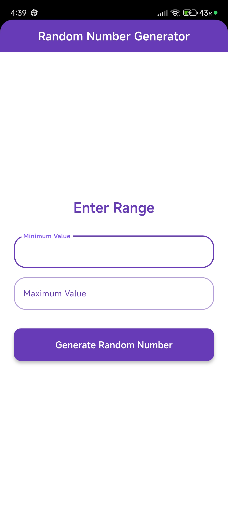
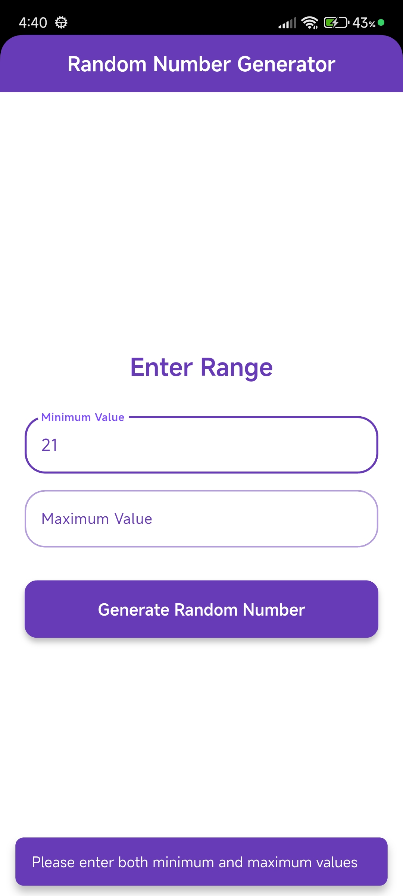
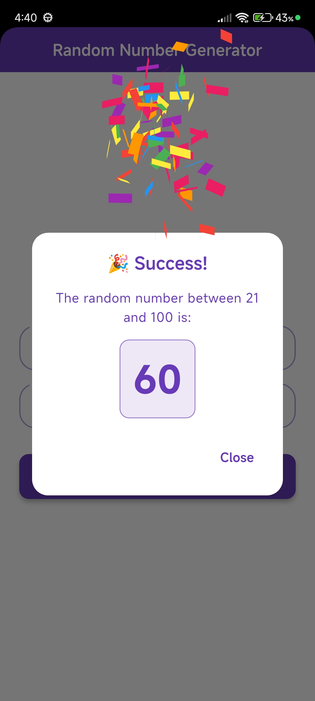

# 🎲 Random Number Generator

A beautiful Flutter application that generates random numbers within a specified range, built with Clean Architecture principles and featuring a stunning UI with confetti animations.

## 📱 Screenshots

<!-- Add your screenshots here -->
<div align="center">
  
  
  
  
  
</div>

## ✨ Features

- 🎯 **Random Number Generation**: Generate random numbers between any minimum and maximum values
- ✅ **Input Validation**: Smart validation ensures minimum value is less than maximum
- 🎉 **Confetti Animation**: Celebrate each generated number with a delightful confetti effect
- 🎨 **Beautiful UI**: Clean, modern interface with white and deep purple theme
- 📱 **Responsive Design**: Adaptive UI that works seamlessly across different screen sizes
- ⚡ **Fast & Efficient**: Optimized performance with proper state management
- 🏗️ **Clean Architecture**: Well-structured codebase following Uncle Bob's Clean Architecture principles

## 🎨 Design

- **Color Scheme**: White background with Deep Purple accents
- **Typography**: Poppins font family for a modern, clean look
- **Material Design 3**: Latest Material Design guidelines
- **Smooth Animations**: Engaging user experience with confetti celebrations

## 🏗️ Architecture

This project follows **Clean Architecture** principles with clear separation of concerns:

```
lib/
├── data/
│   └── random_number_repository_imp.dart    # Repository implementation
├── domain/
│   ├── entities/
│   │   └── random_number.dart               # Domain entity
│   ├── repositories/
│   │   └── random_number_repository.dart    # Repository interface
│   └── usecases/
│       └── generate_random_number.dart      # Business logic
└── presentation/
    ├── pages/
    │   └── random_number_generation_screen.dart
    ├── providers/
    │   ├── Input_provider.dart              # Input state management
    │   └── random_number_provider.dart      # Generation state management
    └── widgets/
        ├── Input_widget.dart                # Reusable input field
        ├── generate_button_widget.dart      # Custom button
        └── result_alert_dialog.dart         # Result dialog with confetti
```

### Architecture Layers

1. **Domain Layer**: Contains business logic, entities, and repository interfaces
2. **Data Layer**: Implements repositories and handles data operations
3. **Presentation Layer**: UI components, state management, and user interactions

## 🛠️ Technologies & Packages

- **Flutter SDK**: ^3.9.2
- **Provider**: ^6.1.5+1 - State management
- **Confetti**: ^0.8.0 - Celebration animations
- **Adaptive Platform UI**: ^0.1.100 - Responsive design
- **Clean Architecture**: Design pattern for maintainable code

## 🚀 Getting Started

### Prerequisites

- Flutter SDK (3.9.2 or higher)
- Dart SDK (3.9.2 or higher)
- Android Studio / VS Code
- Android device or emulator / iOS device or simulator

### Installation

1. **Clone the repository**

   ```bash
   git clone https://github.com/yourusername/random_num_generator.git
   cd random_num_generator
   ```

2. **Install dependencies**

   ```bash
   flutter pub get
   ```

3. **Run the app**
   ```bash
   flutter run
   ```


## 📖 How to Use

1. **Launch the app** on your device
2. **Enter the minimum value** in the first input field
3. **Enter the maximum value** in the second input field
4. **Tap "Generate Random Number"** button
5. **Enjoy the confetti** 🎉 as your random number is revealed!
6. **Tap "Close"** to generate another number

### Input Validation

The app includes smart validation:

- ✅ Both fields must be filled
- ✅ Values must be valid numbers
- ✅ Minimum value must be less than maximum value
- ❌ Error messages guide you if validation fails

## 🎯 Key Features Explained

### Random Number Generation

Uses Dart's `Random` class with a simulated delay to provide a realistic generation experience.

### State Management

Implements Provider pattern for efficient state management:

- `InputProvider`: Manages user input and validation
- `RandomNumberProvider`: Handles random number generation and loading states

### Confetti Animation

Automatic confetti celebration when displaying results, creating a delightful user experience.

### Theme System

Comprehensive Material 3 theme with:

- Custom color scheme (Deep Purple & White)
- Poppins font family
- Consistent styling across all components

## 🤝 Contributing

Contributions are welcome! Please feel free to submit a Pull Request.

1. Fork the project
2. Create your feature branch (`git checkout -b feature/AmazingFeature`)
3. Commit your changes (`git commit -m 'Add some AmazingFeature'`)
4. Push to the branch (`git push origin feature/AmazingFeature`)
5. Open a Pull Request


## 👨‍💻 Author

**Hiba Moukhlij**

- GitHub: [1ynies](https://github.com/1ynies)


## 🙏 Acknowledgments

- Flutter team for the amazing framework
- Material Design for design guidelines
- Clean Architecture principles by Robert C. Martin (Uncle Bob)
- Confetti package contributors

## 📞 Support

If you have any questions or need help, please open an issue in the GitHub repository.

---

<p align="center">Made with ❤️ using Flutter</p>
